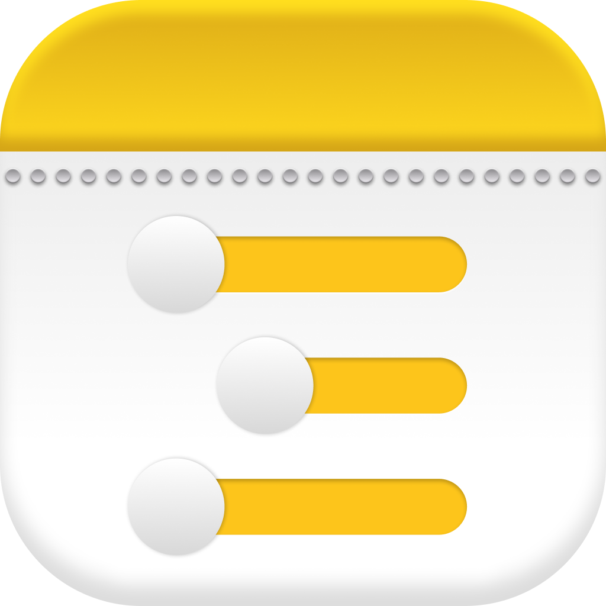
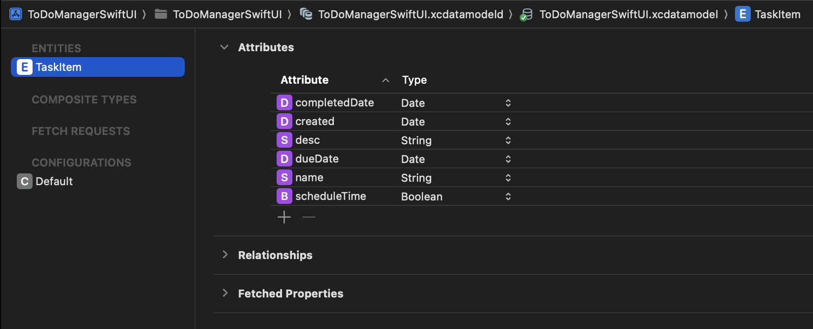

  
    
  
  
  
  
   
  
  
  

# To Do Manager 2.0

  - Version 2.0
  - Programming language: Swift
  - Framework: SwiftUI
  - Architecture: MVVM
  - Data Storage: CoreData

[1st App Version: UIKit, MVC, UserDefaults](https://github.com/1lyazz/ToDoManager)

  To-Do Manager is a simple task manager that lets you create, edit, delete, view task history and mark tasks as completed. 
  In the 2nd App version, I migrated from UIKit to SwiftUI, MVC to MVVM and UserDefaults to CoreData.

  
    
  Xcdatamodel

## App Demo  

 
  

